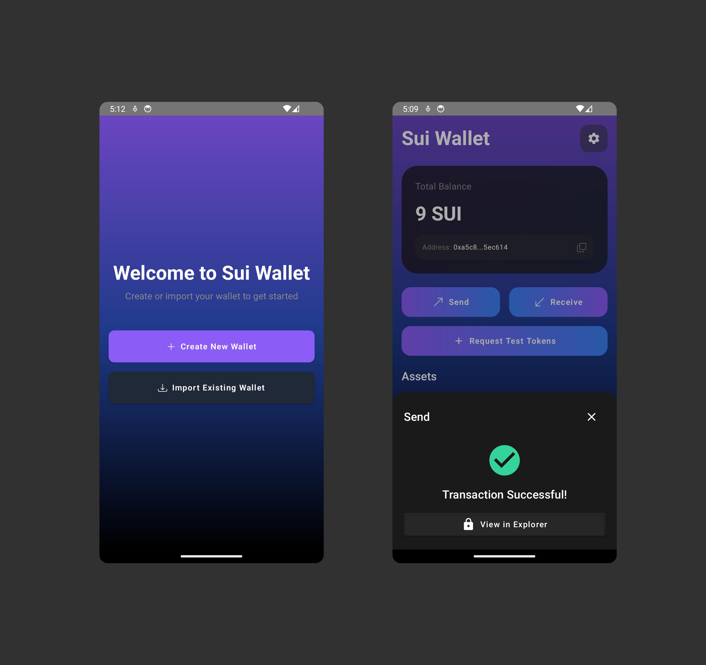
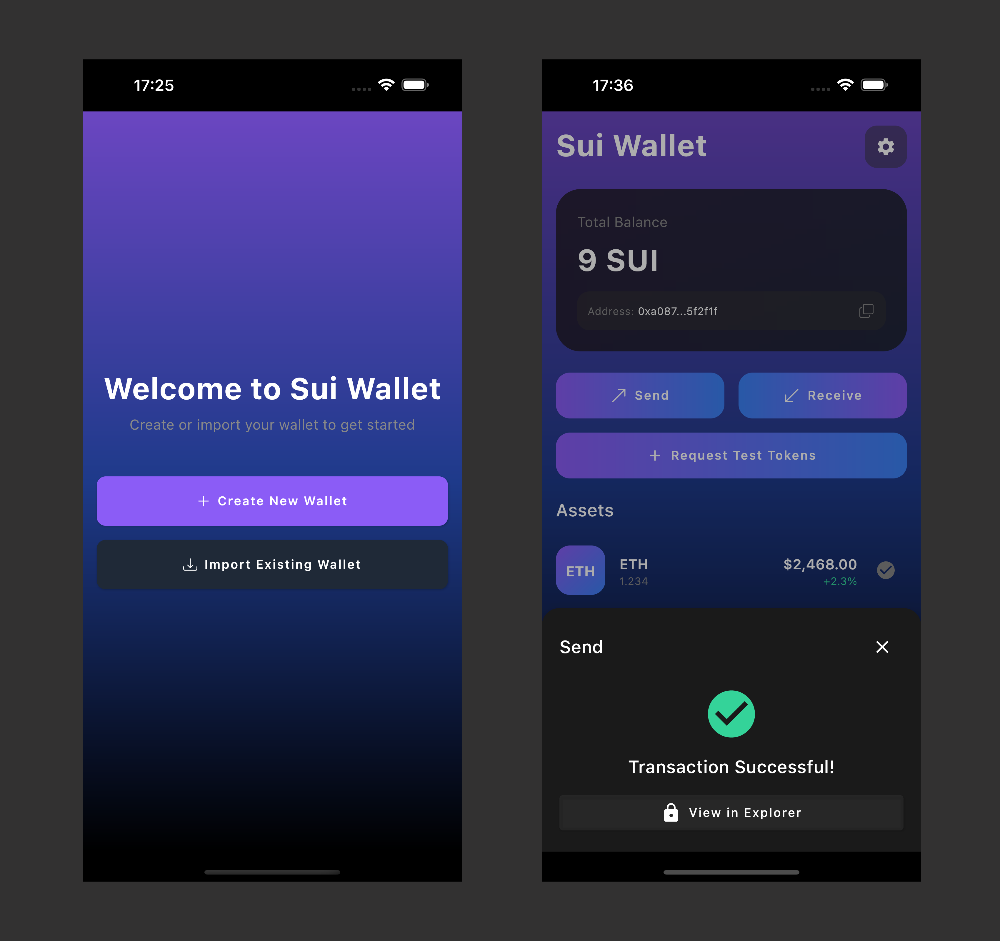

# Sui Wallet

**Sui Wallet** is a cross-platform mobile wallet built with **Kotlin Multiplatform**, **Jetpack Compose**, and the **Sui 
Kotlin Multiplatform library ([Ksui](getting-started.topic))**, showcasing seamless integration with the Sui blockchain. It serves as a reference implementation for developers looking to integrate Sui into mobile applications.

## Android Sui Wallet

## iOS Sui Wallet

Discover the complete source code for Sui Wallet on GitHub: [Sui Wallet Repository](https://github.com/mcxross/sui-cookbook-examples/tree/main/sui-wallet)